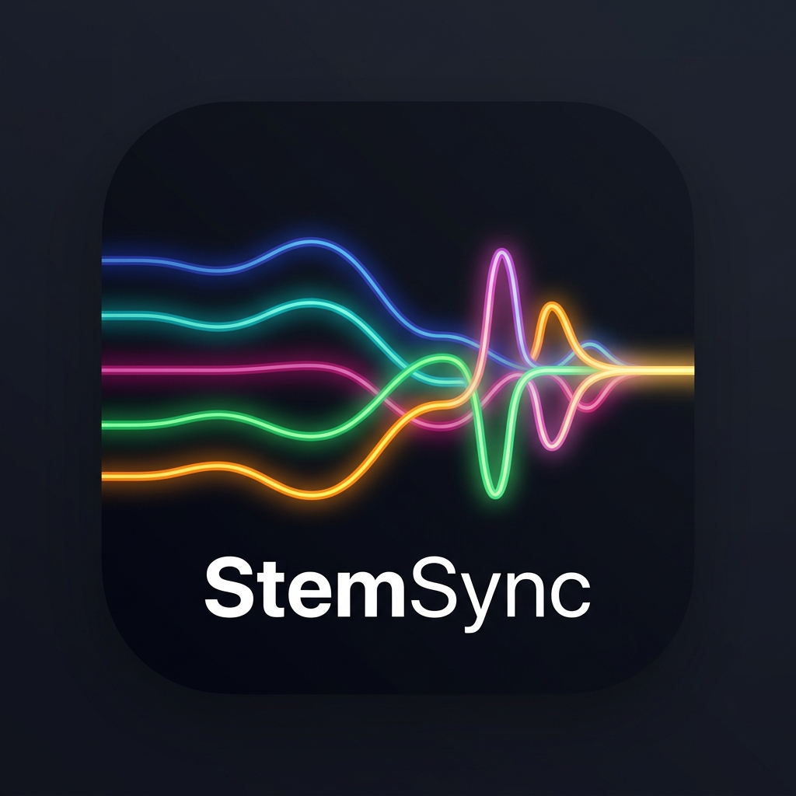

# StemSync

**StemSync** is a powerful mobile application designed for musicians, producers, and singers. It allows you to take any standard audio file, completely separate it into individual instrument stems using state-of-the-art AI, and dynamically mix, pitch-shift, and tempo-shift those stems in real-time on your Android device.

## 🌟 Key Features

*   **🎸 AI Stem Separation:** Powered by Demucs, the companion Windows Packager intelligently isolates Vocals, Drums, Bass, Guitar, and Piano from any mixed MP3/WAV file.
*   **🎛️ Real-Time 6-Track Mixer:** A fully interactive studio mixer built right into your phone. Features dynamic volume control, magnetic center-snapping stereo panning (L/R), and dedicated Mute & Solo buttons for every stem.
*   **⏱️ Pitch & Tempo Manipulation:** Instantly shift the key of the song without affecting the tempo, or speed up/slow down the tempo without altering the pitch. Perfect for practice and rehearsal.
*   **🎼 Dynamic Ribbon UI:** Beautiful, scrolling visual ribbons for Lyrics, Chords, and Song Sections that track automatically with the playback timestamp.
*   **🥁 Integrated Metronome:** A built-in customizable metronome with subdivision support that synchronizes perfectly with the track's BPM.
*   **💾 Persistent Mixes:** Your custom volume, pan, and mute states are saved automatically per song. When you load the track again, your mix is exactly how you left it.

## 📥 Installation & Usage

StemSync operates in a two-part workflow to save your phone's battery and processing power. The heavy AI lifting is done on your PC, and the resulting project is sent to your phone for mixing.

### 1. The Windows Packager (PC)
1. Navigate to the [Releases](https://github.com/SirEthic/StemSync/releases) page and download `StemSync_Packager_Setup.exe`.
2. Install the program.
3. Open the Packager and select any MP3 or WAV file. It will automatically separate the stems, fetch the lyrics/chords, fingerprint the song via Shazam, and compile everything into a single `.zip` project file.

### 2. The StemSync App (Android)
1. Download the latest `StemSync_v1.X.X_arm64.apk` from the [Releases](https://github.com/SirEthic/StemSync/releases) page and install it on your Android phone.
2. Transfer the `.zip` project file generated by your PC onto your phone.
3. Open StemSync, tap the **Folder** icon, select the `.zip` file, and start mixing!

## 🛠️ Built With

*   **Flutter & Dart** - Mobile Application UI
*   **SoLoud** - High-performance C++ audio engine for low-latency playback
*   **Python (PyTorch & Demucs)** - AI Audio Source Separation
*   **Shazamio** - Audio fingerprinting and metadata retrieval

## 📄 License

This project is open-source and available under standard licenses.
